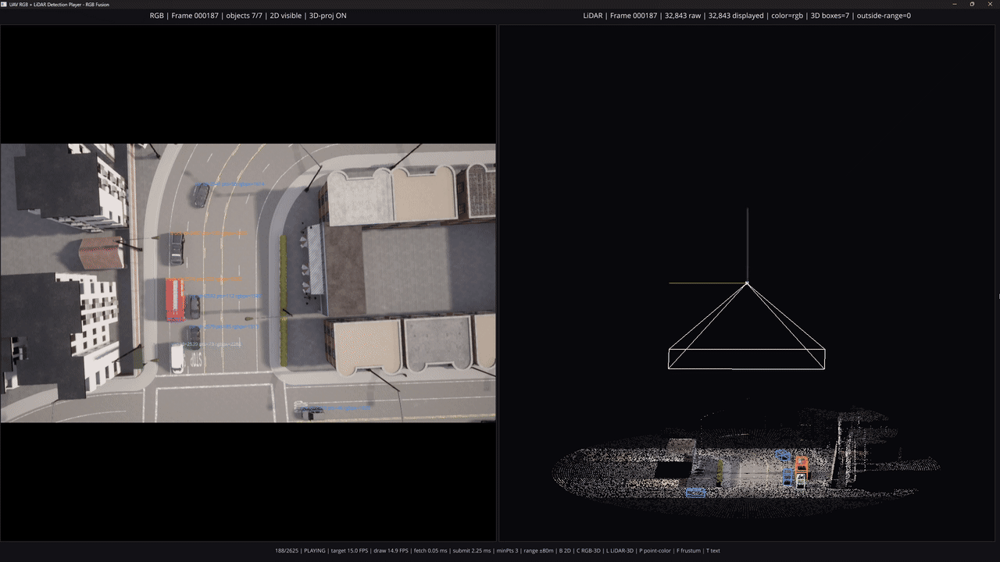
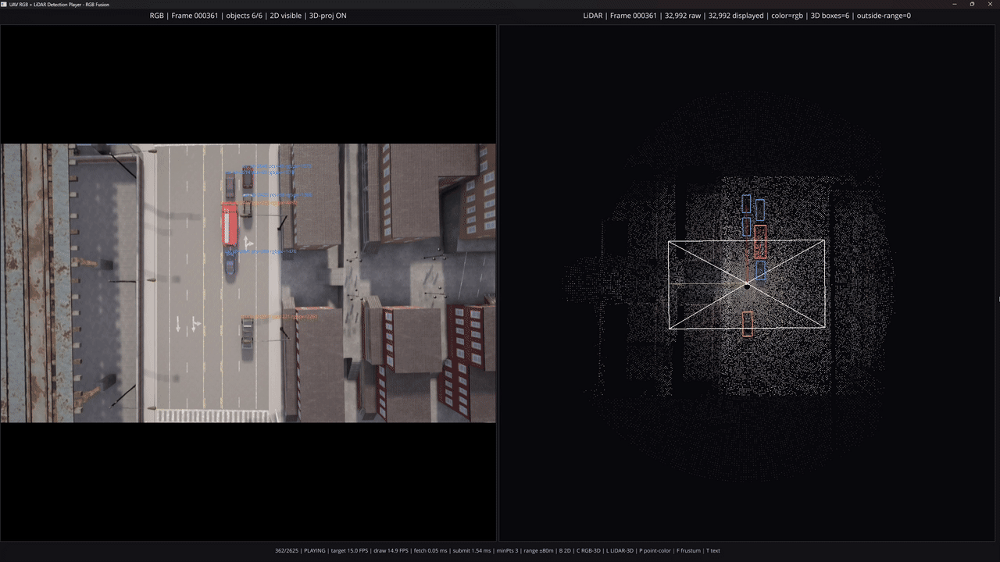
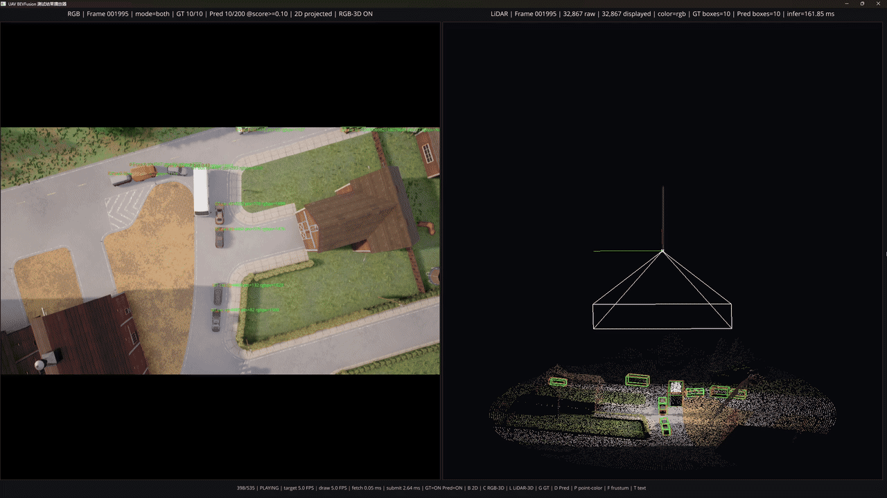
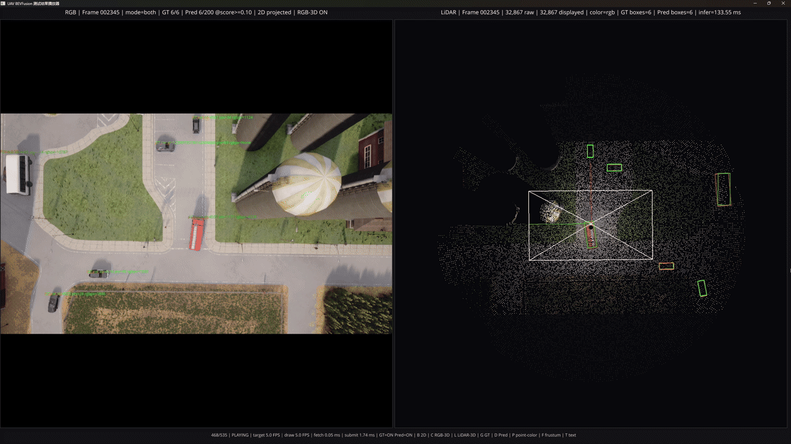

# CARLA UAV Camera–LiDAR Dataset

|||
| --- | --- |
|||

## 简介
这是一个基于 [CARLA](https://carla.org/) (v0.9.16)的无人机视角多传感器数据集录制与回放工具。项目让 UAV 沿 CARLA 道路规划路线飞行，在固定高度采集同步的 RGB 图像、LiDAR 点云、位姿和目标标注，用于无人机视角下的 3D 检测、点云可视化和模型结果检查。

开发者可以使用路线编辑器配置飞行路线，使用采集器生成场景数据，使用播放器检查 RGB、LiDAR 和标注，并将检测模型的预测结果与真实标注叠加查看。

## 项目概览

### 主要功能

- 在 CARLA 中编辑并保存 UAV 路线。
- 按统一采集频率（10 Hz）同步采集 RGB、128 线 LiDAR、UAV 位姿和 2D/3D 标注。
- 支持车辆、卡车、公交车等类别，并保存世界坐标、LiDAR 坐标和相机坐标下的 3D 框。
- 数据集回放：左侧显示 RGB，右侧显示可旋转的 LiDAR 点云、相机视锥和标注框。
- 回放 ground truth 与外部检测模型预测结果，支持 `gt`、`pred` 和 `both` 三种模式。

### 数据集规模

数据集覆盖 8 个 CARLA Town 场景，共包含 **29,505 帧**，约 **49.18 分钟**的飞行数据，累计路线长度约 **23.59 km**，磁盘占用约 **57.69 GiB**，共 **217,871 个目标标注**。

| 场景 | 帧数 | 时长 (min) | 路线长度 (km) | 大小 (GiB) | 目标标注数 |
| --- | ---: | ---: | ---: | ---: | ---: |
| `Town01_Opt` | 2,253 | 3.76 | 1.80 | 3.99 | 16,137 |
| `Town02_Opt` | 1,299 | 2.17 | 1.04 | 2.65 | 12,104 |
| `Town03_Opt` | 2,625 | 4.38 | 2.10 | 5.05 | 17,953 |
| `Town04_Opt` | 7,025 | 11.71 | 5.62 | 13.35 | 44,781 |
| `Town05_Opt` | 4,890 | 8.15 | 3.91 | 9.72 | 41,497 |
| `Town06_Opt` | 7,351 | 12.25 | 5.88 | 14.45 | 59,439 |
| `Town07_Opt` | 2,682 | 4.47 | 2.14 | 5.48 | 12,370 |
| `Town10HD_Opt` | 1,380 | 2.30 | 1.10 | 3.00 | 13,590 |
| **总计** | **29,505** | **49.18** | **23.59** | **57.69** | **217,871** |

各数据模态均按相同帧编号同步保存：

| 数据模态 | 文件数 | 大小 (GiB) |
| --- | ---: | ---: |
| RGB 图像 | 29,505 | 39.32 |
| LiDAR 点云 | 29,505 | 14.47 |
| UAV 位姿 | 29,505 | 0.08 |
| 目标标注 | 29,505 | 3.83 |

当前标注包含 4 类车辆目标：

| 类别 | 标注数量 |
| --- | ---: |
| `car` | 160,458 |
| `van` | 27,577 |
| `truck` | 26,077 |
| `bus` | 3,759 |

### 数据组织

数据按照 CARLA 场景分别存放在 `dataset/<scene>/` 中。RGB 图像、LiDAR 点云、位姿和标注使用相同的六位帧编号一一对应；每个场景同时保存采集元数据和相机-LiDAR 标定信息。

```text
dataset/
├─ Town01_Opt/
│  ├─ calibration.json
│  ├─ metadata.json
│  ├─ rgb/
│  │  ├─ 000000.png
│  │  ├─ 000001.png
│  │  └─ ...
│  ├─ lidar/
│  │  ├─ 000000.bin
│  │  ├─ 000001.bin
│  │  └─ ...
│  ├─ pose/
│  │  ├─ 000000.json
│  │  ├─ 000001.json
│  │  └─ ...
│  └─ labels/
│     ├─ 000000.json
│     ├─ 000001.json
│     └─ ...
├─ Town02_Opt/
├─ Town03_Opt/
├─ Town04_Opt/
├─ Town05_Opt/
├─ Town06_Opt/
├─ Town07_Opt/
└─ Town10HD_Opt/
```

其中：

- `rgb/*.png`：同步的 UAV 俯视 RGB 图像。
- `lidar/*.bin`：同步 LiDAR 点云，以 `float32` 保存，每个点包含 `[x, y, z, intensity]`。
- `pose/*.json`：当前帧 UAV、相机与 LiDAR 的位姿及帧级信息。
- `labels/*.json`：当前帧目标标注，包括类别、可见性信息、LiDAR 点数以及 2D/3D 边界框。
- `calibration.json`：相机内参、相机-LiDAR 外参及坐标系定义。
- `metadata.json`：场景、路线、采样频率、交通和标注配置等采集元数据。

## 安装部署

推荐使用 conda 管理 Python 依赖。使用以下指令创建名为`carla`的`conda`虚拟环境并激活:

```powershell
conda create -n carla python=3.10
conda activate carla
```

安装环境依赖：

```powershell
pip install -r requirements.txt
```

## 使用方法

> 在进行路线编辑和数据集录制时一定要确保 CARLA 服务端处于**启动**状态！

### 前期准备

使用以下指令激活虚拟环境：

```powershell
conda activate carla
```

设置采集与录制信息

- `configs/UAVdataset.yaml`：文件主要记录录制与采集的参数信息，根据需要可以修改其中的 FPS、录制帧数、UAV 高度、交通数量、相机/LiDAR 参数、标注类别和输出选项。

- `configs\routes`：文件夹下存放着carla不同地图对应录制好的路线，以对应的地图名命名。

> `configs/UAVdataset.yaml`中数据集输出默认在`dataset`文件夹下。项目根目录下打开终端，使用以下指令创建数据集存放文件夹

```powershell
mkdir dataset
```

### 采集路线编辑

修改`configs/UAVdataset.yaml`中的`route_file`为指定的路线文件路径。若指定路线文件不存在，脚本则会在路径下新建指定文件并录制；若指定路线文件存在，则自动加载已有路线，并在原有基础上继续编辑。

运行以下指令打开路线编辑器：

```powershell
python scripts/route_editor.py
```

主要快捷键如下：

- `m`：切换 CARLA 地图
- `a`：添加锚点
- `u`：撤销最后一个锚点，并重新规划路线
- `p`：打印当前锚点和规划路径信息
- `s`：保存路线
- `q`：保存路线并退出
- `n`：新建路线
- `r`：加载已有路线
- `c`：清空当前路线
- `Esc`：不保存并退出

### 数据集采集

> 在运行采集脚本之前注意关闭路线编辑器，否则采集脚本有可能会录到路线编辑器加载的路线信标。

根据需要修改 `configs/UAVdataset.yaml` 中的参数，包括指定录制地图的路线图文件`route_file`，然后运行以下指令进行数据集采集：

```powershell
python scripts/collect_uavdataset.py
```

采集器会自动加载地图路线文件对应的地图，并等待15s热身交通。录制的文件名默认按照"scene_"+"时间"组合，也可在`scripts\collect_uavdataset.py`中，修改`scene_name`以指定数据集名称。

> 当前名称为指定名称：`Town05_Opt`。

### 数据集回放

使用以下指令运行回放数据集脚本：

```powershell
python scripts/play_uavdataset.py `
    --scene dataset\Town06_Opt `
    --fps 15 `
    --range 80 `
    --max-points 0 `
    --prefetch 12 `
    --io-workers 2
```

回放窗口左侧为同步的 **RGB 图像视图**，用于显示相机图像、二维检测框、投影后的三维检测框以及目标类别与编号；右侧为 **LiDAR 三维点云视图**，用于显示点云、三维检测框、坐标轴及相机视锥，可以使用鼠标进行旋转与缩放查看。点云默认使用同步 RGB 图像进行着色。

窗口主要运行参数如下：

- `scene`：指定需要回放的数据集场景目录。
- `fps`：指定目标回放帧率，单位为 FPS，默认为 `15`。
- `range`：指定 LiDAR 三维视图的显示范围，单位为米，默认为 `80`。
- `max-points`：指定单帧最多显示的点云数量，默认为 `0`，显示范围内的全部点云。
- `prefetch`：指定预加载的帧数，默认为 `8`。适当增大该值可以减少回放过程中等待磁盘读取的情况，但会占用更多内存。
- `io-workers`：指定后台数据读取线程数，默认为 `2`。
- `point-size`：指定 LiDAR 点云的显示点大小，默认为 `2.0`。
- `loop`：启用循环回放，播放到数据集最后一帧时会自动从第一帧重新开始，默认关闭。

窗口快捷键如下：

* `Space`：暂停或继续回放。
* `B`：切换左侧 RGB 图像中的二维检测框显示模式，依次在**可见区域检测框**、**完整投影检测框**和**关闭二维检测框**之间循环切换。
* `C`：显示或隐藏左侧 RGB 图像中投影的三维检测框。
* `L`：显示或隐藏右侧 LiDAR 点云中的三维检测框。
* `P`：切换 LiDAR 点云着色方式，在 **RGB 图像颜色**和**高度颜色**之间切换。
* `F`：显示或隐藏右侧 LiDAR 视图中的相机视锥。
* `T`：显示或隐藏左侧 RGB 图像中的目标文字信息，包括目标类别、Actor ID 和 LiDAR 点数等。
* `R`：重置右侧 LiDAR 三维视图的相机位置和观察角度。
* `Q`：退出回放窗口。
* `Esc`：退出回放窗口。

### 模型预测结果回放

将`test_uav_predictions.py`脚本复制到`bevfusion`的tools文件夹里，并运行以下指令运行测试数据集并保存测试json结果：

```bash
python tools/test_uav_predictions.py \
  configs/uavdataset/det/transfusion/secfpn/camera+lidar/swint_v0p1/convfuser.yaml \
  runs/uavdataset-bevfusion-balanced-s9/latest.pth \
  --out-dir runs/uavdataset-bevfusion-s9/test_predictions
```

以`Town07_Opt`为预测示例，将模型预测好的标注文件夹`test_predictions`放入`data`文件夹下，标注文件结构如下：

```text
test_predictions/
├─ manifest.json
├─ metrics.json
├─ summary.json
├─ timing.csv
└─ predictions/
   ├─ Town07_Opt/
   │  ├─ 000009.json
   │  ├─ 000012.json
   │  └─ ...
   └─ ...
```

使用以下指令运行预测回放：

- 同时显示 GT + Prediction

```powershell
python .\scripts\play_uav_test_results.py `
    --scene .\dataset\Town07_Opt `
    --pred-dir .\dataset\test_predictions `
    --mode both `
    --score-threshold 0.1
```

- 只显示 Prediction

```powershell
python .\scripts\play_uav_test_results.py `
    --scene .\dataset\Town07_Opt `
    --pred-dir .\results\test_predictions `
    --mode pred `
    --score-threshold 0.3
```

- 只显示 GT

```powershell
python .\scripts\play_uav_test_results.py `
    --scene .\dataset\Town07_Opt `
    --pred-dir .\results\test_predictions `
    --mode gt
```

指令运行参数和窗口快捷键同上。